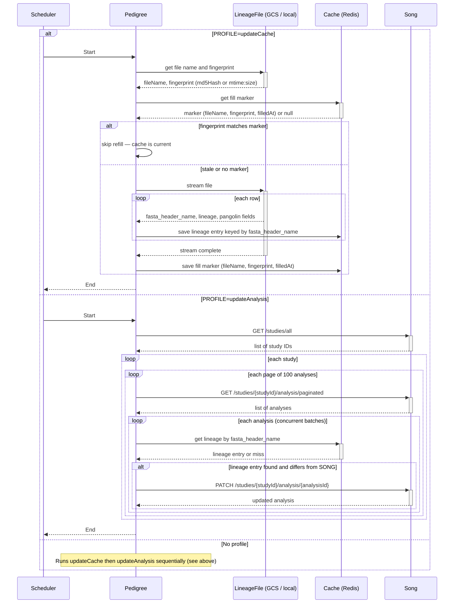

```mermaid
sequenceDiagram
    participant Scheduler
    participant Pedigree
    participant LineageFile as LineageFile (GCS / local)
    participant Cache as Cache (Redis)
    participant Song

    alt PROFILE=updateCache

        Scheduler->>Pedigree: Start

        Pedigree->>+LineageFile: get file name and fingerprint
        LineageFile-->>-Pedigree: fileName, fingerprint (md5Hash or mtime:size)

        Pedigree->>+Cache: get fill marker
        Cache-->>-Pedigree: marker (fileName, fingerprint, filledAt) or null

        alt fingerprint matches marker
            Pedigree->>Pedigree: skip refill — cache is current
        else stale or no marker
            Pedigree->>+LineageFile: stream file
            loop each row
                LineageFile-->>Pedigree: fasta_header_name, lineage, pangolin fields
                Pedigree->>Cache: save lineage entry keyed by fasta_header_name
            end
            LineageFile-->>-Pedigree: stream complete
            Pedigree->>Cache: save fill marker (fileName, fingerprint, filledAt)
        end

        Pedigree-->>Scheduler: End

    else PROFILE=updateAnalysis

        Scheduler->>Pedigree: Start

        Pedigree->>+Song: GET /studies/all
        Song-->>-Pedigree: list of study IDs

        loop each study
            loop each page of 100 analyses
                Pedigree->>+Song: GET /studies/{studyId}/analysis/paginated
                Song-->>-Pedigree: list of analyses

                loop each analysis (concurrent batches)
                    Pedigree->>+Cache: get lineage by fasta_header_name
                    Cache-->>-Pedigree: lineage entry or miss

                    alt lineage entry found and differs from SONG
                        Pedigree->>+Song: PATCH /studies/{studyId}/analysis/{analysisId}
                        Song-->>-Pedigree: updated analysis
                    end
                end
            end
        end

        Pedigree-->>Scheduler: End

    else No profile

        note over Pedigree: Runs updateCache then updateAnalysis sequentially (see above)

    end
```
